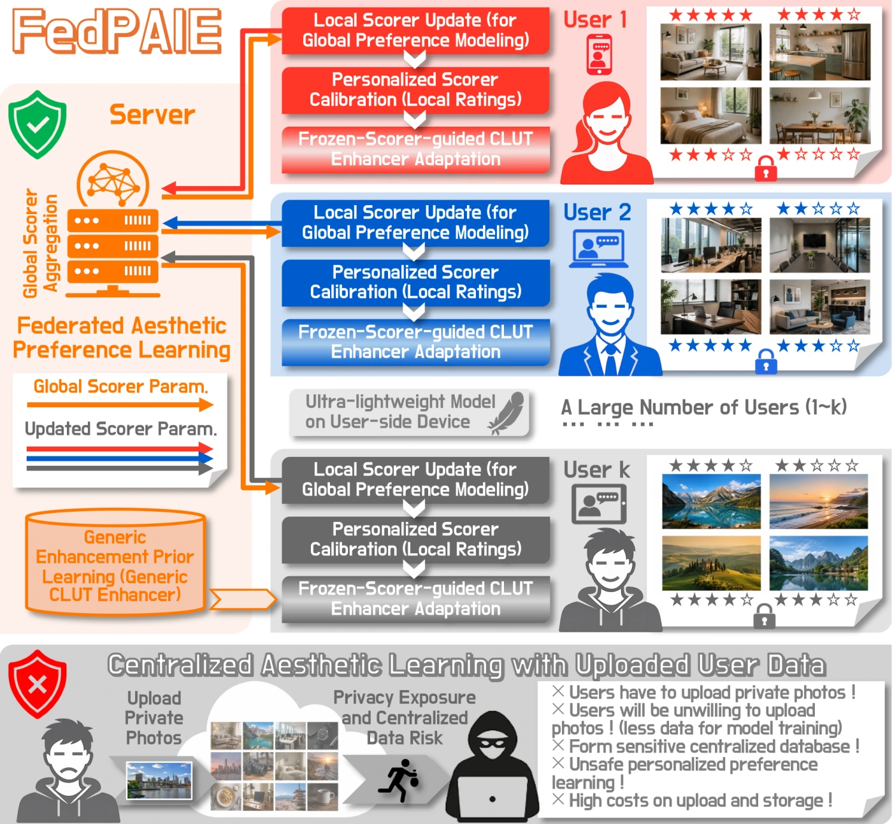
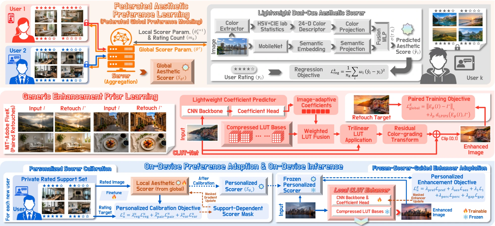
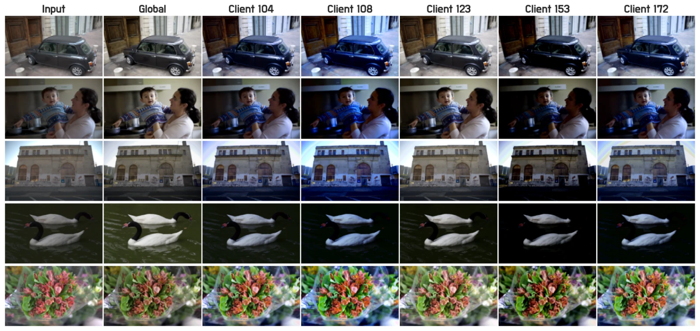

<div align="center">
  <h1>FedPAIE</h1>
  <h3>Learning Color Grading, No Photo Sharing</h3>
  <p><strong>Federated Aesthetic Preference Learning for Personalized Image Enhancement</strong></p>
  <p>
    <a href="https://arxiv.org/abs/2607.27659"></a>
    <a href="pyproject.toml"></a>
    <a href="LICENSE"></a>
    
  </p>
  <p>
    <a href="#method-at-a-glance">Overview</a> ·
    <a href="#installation">Installation</a> ·
    <a href="#data">Data</a> ·
    <a href="#training-and-personalization">Training</a> ·
    <a href="#inference">Inference</a> ·
    <a href="#citation">Citation</a>
  </p>
</div>

<p align="center">
  <a href="assets/teaser.webp"></a>
</p>

<p align="center"><sub>Global preference knowledge is aggregated without centralizing raw user data, while scorer calibration and color-grading adaptation remain user-specific.</sub></p>

FedPAIE learns personalized image color grading from decentralized, sparse user
ratings. It first simulates federated training of a lightweight dual-cue aesthetic
scorer, calibrates that scorer for an unseen user, and then freezes it to guide local
adaptation of a compact CLUT enhancer from unpaired photographs. Deployment retains
only the personalized enhancer.

> **Release scope.** This repository contains source code and the documentation figures
> shown below. It does not include source datasets, per-image ratings, cached features,
> raw evaluation outputs, or model checkpoints.

## Highlights

- **Data-local personalization.** Raw user photos and ratings remain on the simulated
  client while only scorer parameters are aggregated.
- **Sparse preference adaptation.** Personalized Scorer Calibration supports both
  10-shot and 100-shot user feedback.
- **Lightweight throughout.** The scorer has 0.787M trainable parameters, enhancer
  adaptation updates only 0.265M parameters, and on-device inference retains a 0.293M
  personalized enhancer.

## Method at a glance

1. **Federated Aesthetic Preference Learning** trains a global aesthetic scorer with
   weighted regression and square-root FedAvg.
2. **Generic Enhancement Prior Learning** trains a compact CLUT enhancer on paired
   [MIT-Adobe FiveK](https://data.csail.mit.edu/graphics/fivek/) images.
3. **Personalized Scorer Calibration** adapts the global scorer from 10 or 100 local
   support ratings using regression, pairwise ordering, and variance preservation.
4. **Frozen-Scorer-Guided Enhancer Adaptation** updates only the CLUT coefficient
   predictor from unpaired local images. The LUT bases and scorer remain frozen.
5. **Personalized On-Device Inference** uses only the 292,541-parameter enhancer.

| Stage | Trainable parameters | Role |
|---|---:|---|
| Federated scorer training | 0.787M | Shared preference initialization |
| 10-shot scorer calibration | 0.527M | Masked local calibration |
| 100-shot scorer calibration | 0.787M | Full local calibration |
| Enhancer adaptation | 0.265M | CNN backbone and coefficient head |
| On-device inference | 0.293M retained | Personalized color grading |

The scorer combines a 24-D HSV/Lab statistical descriptor with a frozen 960-D
MobileNetV3-Large semantic descriptor. The default enhancer configuration is
`20+05+20`: 20 LUT bases, spatial rank 5, and width rank 20.

<p align="center">
  <a href="assets/pipeline.webp"></a>
</p>

<p align="center"><sub>FedPAIE pipeline from Federated Aesthetic Preference Learning and Generic Enhancement Prior Learning to local scorer calibration and frozen-scorer-guided enhancer adaptation.</sub></p>

## Personalized color-grading examples

The global enhancer supplies a common initialization, while local adaptation produces
distinct client-specific color transformations without changing spatial content.

<p align="center">
  <a href="assets/qualitative_results.webp"></a>
</p>

<p align="center"><sub>Representative personalized variation across five unseen clients. Each column uses the same input images and a different calibrated user preference.</sub></p>

## Repository layout

```text
datasets/                 portable Flickr-AES and FiveK data pipelines
evaluation/               FiveK reference evaluation
losses/                   paper-aligned scorer and enhancer objectives
models/scorer/            lightweight dual-cue aesthetic scorer
models/clut_net/          compact residual CLUT enhancer
training/                 federated training and local personalization
tests/                    lightweight unit tests
inference.py              personalized enhancement entry point
```

## Installation

Python 3.10 or newer is required. Clone the repository and create an isolated
environment from its root:

```bash
git clone https://github.com/LouckXu/FedPAIE.git
cd FedPAIE
python -m venv .venv
```

Activate it with `source .venv/bin/activate` on macOS or Linux, or with
`.venv\Scripts\Activate.ps1` in Windows PowerShell. Then install the runtime
dependencies:

```bash
python -m pip install --upgrade pip
python -m pip install -r requirements.txt
```

For tests and code-quality checks:

```bash
python -m pip install -r requirements-dev.txt
python -m pytest
ruff check .
```

The first semantic-feature extraction may download the standard ImageNet
MobileNetV3-Large weights through Torchvision. LPIPS may likewise download its AlexNet
weights. Pre-download or cache them for offline execution.

## Data

> **Reproduction scope.** The commands below build a deterministic release dataset
> from legally obtained source data. Exact paper numbers additionally require the
> paper-matched manifests and checkpoints, which are not distributed in this public
> release.

Obtain each dataset from its owner and follow its usage terms:

- [Flickr-AES author repository](https://github.com/alanspike/personalizedImageAesthetics)
- [MIT-Adobe FiveK project page](https://data.csail.mit.edu/graphics/fivek/)

The Flickr-AES pipeline expects:

```text
data/
├── raw/
│   ├── FLICKR-AES_image_labeled_by_each_worker.csv
│   └── flickr_images/
├── split/
│   └── flickr_dp4_split/          generated client CSVs
└── precomputed/
    └── flickr_features/           generated tensor features and index
```

Create deterministic 70/10/10/10 client partitions and cache the fixed descriptors:

```bash
python -m datasets.preprocess_flickr_aes --data-root data
python -m datasets.precompute_features --data-root data --device auto
```

The generated split files contain numeric client IDs only. Original Flickr worker IDs
are discarded before processed outputs are written. Do not publish derived data unless
the dataset terms explicitly permit it.

The official FiveK release provides raw inputs in DNG format and expert renditions as
16-bit ProPhoto RGB TIFF files. Before running the commands below, consistently develop
or export the DNG inputs to ProPhoto RGB TIFF files and place them in
`data/fivek/raw_input`. Place the Expert C TIFF files in
`data/fivek/raw_expert_c`. The current preprocessing command accepts TIFF input and
converts each collection to resized sRGB JPEGs:

```bash
python -m datasets.preprocess_fivek \
  --input-dir data/fivek/raw_input \
  --output-dir data/fivek/input \
  --collection-label input

python -m datasets.preprocess_fivek \
  --input-dir data/fivek/raw_expert_c \
  --output-dir data/fivek/expert_c \
  --collection-label expert_c
```

Create filename-only train/validation/test manifests without copying the images:

```bash
python -m datasets.split_fivek \
  --input-dir data/fivek/input \
  --target-dir data/fivek/expert_c \
  --output-dir data/fivek/splits \
  --train-ratio 0.8 \
  --val-ratio 0.1 \
  --seed 42
```

The DNG development step is not implemented here and its settings affect the resulting
images. The 80/10/10 split is a deterministic release default rather than the exact
paper evaluation subset. Use the paper-matched manifest when comparing directly with
reported numbers.

## Training and personalization

### 1. Federated scorer

```bash
python -m training.train_federated_scorer \
  --data-root data \
  --output-dir outputs/federated_scorer \
  --rounds 20 \
  --device auto
```

By default, the script holds out 37 unseen identities, uses 10 fixed validation
identities, includes every eligible client in each round, and aggregates updates in
proportion to the square root of the actual processed example count. Eligibility for
the unseen cohort requires at least 100 `personalization` samples and at least 10
validation and test samples. Scorer support ratings are sampled from `train_fl`; the
`personalization` split supplies unpaired images for enhancer adaptation. Global scorer
updates use AdamW (`weight_decay=1e-4`) and the paper's global class-reweighting rule.
Validation correlations are computed per validation client and macro-averaged.

### 2. Personalized scorer calibration

```bash
python -m training.personalize_scorer \
  --data-root data \
  --global-checkpoint outputs/federated_scorer/checkpoint_best_srcc.pt \
  --split-file outputs/federated_scorer/open_world_user_split.json \
  --output-dir outputs/personalized_scorers \
  --support-sizes 10,100 \
  --mode hpo \
  --device auto
```

Use `--mode fixed_hp` for the fixed-hyperparameter protocol. The HPO mode uses a
deterministically seeded Optuna TPE sampler. Checkpoint selection uses validation data;
the test split is evaluated only after selection.

The command above runs up to 20 trials for every unseen user at both support sizes,
which is a full experiment rather than a quick demo. For a pipeline smoke test, append
`--max-clients 1 --trials 1 --epochs 1 --max-batches 1`.

### 3. Generic enhancement prior

```bash
python -m training.train_generic_enhancer \
  --input-dir data/fivek/input \
  --target-dir data/fivek/expert_c \
  --train-manifest data/fivek/splits/train.txt \
  --val-manifest data/fivek/splits/val.txt \
  --output-dir outputs/generic_enhancer \
  --device auto
```

This release example trains the generic prior against Expert C. Exact comparison with
the paper requires its common pretrained prior and paper-matched manifest.

### 4. Personalized enhancer adaptation

Choose an ID from the `unseen_users` field of
`outputs/federated_scorer/open_world_user_split.json`, replace `CLIENT_ID` below, and
use the same value in subsequent inference and evaluation commands.

```bash
python -m training.adapt_enhancer \
  --data-root data \
  --global-enhancer-checkpoint outputs/generic_enhancer/generic_enhancer_best.pt \
  --scorer-dir outputs/personalized_scorers \
  --output-dir outputs/personalized_enhancers \
  --client-ids CLIENT_ID \
  --support-size 100 \
  --scorer-mode hpo \
  --preset shared_hpo \
  --min-validation-srcc 0.10 \
  --device auto
```

Both enhancer presets use `--min-validation-srcc` as their shared scorer-eligibility
threshold. Its default of 0.10 matches the paper protocol and keeps their cohorts
aligned. A skipped client is recorded in `adaptation_summary.json` without producing an
enhancer checkpoint. Use `--preset fixed_hp` for the prespecified open-world reference.
The `shared_hpo` preset applies one validation-selected configuration across the
eligible cohort for matched trade-off and ablation analyses. It does not rerun enhancer
HPO for each user. Both presets use seed 60 by default.

Portable enhancer checkpoints record the CLUT architecture automatically.
`--architecture` is needed only for an older state-dict checkpoint without metadata.

## Inference

Portable release checkpoints contain a tensor-only `model_state_dict` and are loaded
without arbitrary Python object deserialization:

```bash
python inference.py \
  --checkpoint outputs/personalized_enhancers/client_CLIENT_ID/client_CLIENT_ID_personalized_enhancer.pt \
  --input /path/to/input.jpg \
  --output-dir outputs/inference \
  --device auto
```

The output preserves the source resolution. For old, trusted full-model PyTorch files,
`--allow-legacy-checkpoint` enables pickle loading. Never use that option with an
untrusted checkpoint.

## Evaluation

The following command evaluates one personalized checkpoint using the paper's
224 x 224 FiveK metric protocol:

```bash
python -m evaluation.evaluate_fivek \
  --checkpoint outputs/personalized_enhancers/client_CLIENT_ID/client_CLIENT_ID_personalized_enhancer.pt \
  --input-dir data/fivek/input \
  --target-dir data/fivek/expert_c \
  --manifest data/fivek/splits/test.txt \
  --image-size 224 \
  --output outputs/evaluation/client_CLIENT_ID.json \
  --device auto
```

This reports per-client PSNR, SSIM, and LPIPS against Expert C. Aggregating paper-style
means and standard deviations across clients requires evaluating every retained
checkpoint. The personalized-scorer predicted gain reported during local adaptation is
an optimization-aligned proxy, not direct evidence of improved human preference.

## Paper notation and code parameters

| Paper term | Public code name |
|---|---|
| `L_reg`, `L_pair`, `L_var` | `lambda_reg`, `lambda_pair`, `lambda_var` |
| `L_pref`, `L_aes` | `lambda_pref`, `lambda_aes` |
| `L_1`, `L_perc`, `L_gap` | `lambda_l1`, `lambda_perc`, `lambda_gap` |
| excess-gain threshold | `mu` |
| LUT bases `beta` | `enhancer.CLUTs` |
| coefficient predictor `psi` | `enhancer.backbone` + `enhancer.classifier` |
| color projection `theta_c` | `scorer.color_proj` |
| semantic projection `theta_s` | `scorer.semantic_proj` |
| fusion head `theta_f` | `scorer.mlp` |
| score temperature `tau` | `scorer.temperature` |
| minimum validation SRCC | `--min-validation-srcc` |

## Privacy scope and limitations

Raw photos and ratings remain local under the simulated federated protocol. This code
implements a **single-machine research simulation** of client-local computation and
parameter aggregation. It does not implement a networked client/server deployment,
secure aggregation, differential privacy, or a formal privacy guarantee. Model updates
may still leak information in adversarial settings; evaluate and add suitable privacy
protections before real-world deployment.

## Reproducibility notes

- All public entry points accept paths through command-line arguments; no machine-local
  paths or usernames are embedded in the code.
- Seeds are exposed and used by Python, NumPy, PyTorch, client sampling, support-set
  construction, and Optuna sampling.
- `--deterministic` is available for federated scorer training, scorer calibration,
  and generic-prior training. Enhancer adaptation seeds its stochastic components with
  seed 60. Exact numerical equality across hardware and library versions is not
  guaranteed.
- Data, cached features, outputs, and checkpoints are intentionally excluded from Git.
- Exact paper results additionally require the same raw dataset release and resulting
  client cohort. This public release does not ship data-derived cohort manifests.

The reported experiments used Windows 11, an Intel Core Ultra 9 285K CPU, an NVIDIA
RTX 5090 GPU, approximately 64 GB of system memory, CUDA 12.8, PyTorch 2.2.2, and
Torchvision 0.17.2. The dependency files use compatible lower bounds rather than an
environment lock, so record the resolved versions for new experiments.

## Checkpoints and third-party status

No pretrained weights are included. Before redistributing any existing weights, confirm
that you have permission from every relevant data and model rightsholder. This release
uses native PyTorch `grid_sample` and does not include the upstream CLUT custom
extension. See
[`THIRD_PARTY_NOTICES.md`](THIRD_PARTY_NOTICES.md).

## License

The FedPAIE source code is licensed under the
[Apache License 2.0](LICENSE). See [NOTICE](NOTICE) for copyright information and
[THIRD_PARTY_NOTICES.md](THIRD_PARTY_NOTICES.md) for third-party acknowledgments and
dataset notices. The paper, datasets, pretrained weights, and other external artifacts
retain their respective terms and are not relicensed by this code license.

## Citation

```bibtex
@misc{xu2026fedpaie,
  title         = {Learning Color Grading, No Photo Sharing: Federated Aesthetic Preference Learning for Personalized Image Enhancement},
  author        = {Xu, Chuanzhi and Tao, Ziyuan and KNell, Jean Julien and Chen, Yanrong and Guo, Haolan and Yin, Xuanhua and Mahmood, Adnan and Cai, Weidong},
  year          = {2026},
  eprint        = {2607.27659},
  archivePrefix = {arXiv},
  primaryClass  = {cs.CV},
  url           = {https://arxiv.org/abs/2607.27659}
}
```
